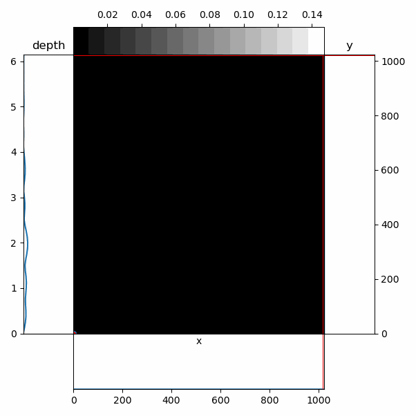

Examples
==========
If you don't have PWS experimental data to run these examples with you can find a dataset that is used for automated testing
on Zenodo here: https://zenodo.org/record/5976039#.Yf6aPt_MJPY

Running basic PWS analysis on a single image.
-----------------------------------------------------------------------------------------
This example runs the PWS analysis on a single measurement. The results of the analysis will be saved alongside the raw data
under the `analyses` folder. Running this example may be required in order for other examples which require that analysis results
already be available.

.. literalinclude:: ../../examples/runPWSAnalysis.py
   :language: python
   :linenos:

Performing FFT to visualize the estimated depth of cell features
--------------------------------------------------------------------------------------
.. literalinclude:: ../../examples/opdExampleScript.py
   :language: python
   :linenos:

Compile analysis results to a table of average values within each ROI
----------------------------------------------------------------------------------------------------------------------
.. literalinclude:: ../../examples/compileResults.py
   :language: python
   :linenos:

Basic loading of ROI's to extract data from specific regions
--------------------------------------------------------------
.. literalinclude:: ../../examples/roiUsageExample.py
   :language: python
   :linenos:

Using a hand-drawn ROI to generate a reference pseudo-measurement
--------------------------------------------------------------------
.. literalinclude:: ../../examples/ROItoReference.py
   :language: python
   :linenos:

Blurring data laterally to smooth a reference image.
-------------------------------------------------------
.. literalinclude:: ../../examples/syntheticReference.py
   :language: python
   :linenos:

Measuring Sigma using only a limited range of the OPD signal.
--------------------------------------------------------------
.. literalinclude:: ../../examples/limitedOPDSigma.py
   :language: python
   :linenos:

Generating new position lists to enable colocalized measurements on multiple systems.
--------------------------------------------------------------
.. literalinclude:: ../../examples/positionTransformation.py
   :language: python
   :linenos:
