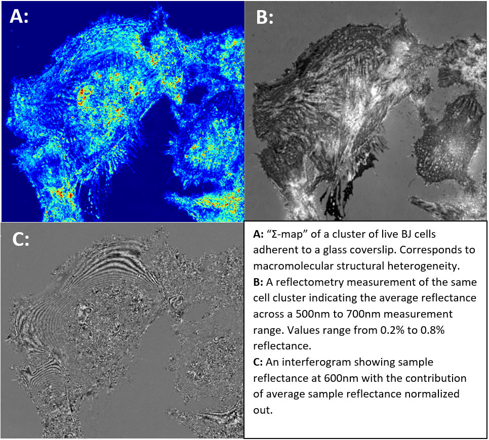

# Summary

Partial Wave Spectroscopic (PWS) Microscopy is a novel spectroscopic microscopy technique that quantitatively 
detects the nanoscale mass density distribution within a biological sample. PWS microscopy achieves sensitivity to nanoscale structures within biological cells by using the spectroscopic content of microscope images, and quantitatively measures nanoarchitectural changes in cells associated with carcinogenesis[@Chandler:2016]. Additionally, PWS does not require exogenous labels and thus works even in unstained samples.

`PWSpy` is a Python module dedicated to the analysis of PWS data. It includes a full suite of tools that prove useful in 
analyzing experimental data. This includes object-oriented representations of the raw data involved as well as the analyzed output data and auxiliary data used such as ROIs, calibration files, and automated imaging metadata produced by the PWS Acquisition[@PWS_Acquisition] plugin for Micro-Manager[@Micro-Manager]. A single PWS measurement can be treated as a 3D image cube with dimensions (x, y, and wavenumber) and a single PWS experiment may consist of thousands of such images colocalized with widefield fluorescence, confocal microscopy, or other interferometric image cubes. With `PWSpy`, it is trivial to skip the basics of preprocessing and get to the heart of extracting meaningful results from your experimental data. Basic operations such as normalization, camera non-linearity compensation, and calibration can all be handled with the call of a single method so you can trust that they have been performed without error. Additionally, the library provides a means for conveniently loading and storing auxiliary data such as ROIs, notes, and analysis results. Utility functionality for generating visualizations, automatic colocalization, basic modeling of reflectance, loading an manipulation of Micro-Manager position list files, and more are provided in the `utility` subpackage.

# Statement of need
Any analysis of raw data generated by PWS microscopy or other related interferometric imaging modalities[@Gladstein:2019] requires loading image data and metadata from a large variety of file formats and performing complex pre-processing steps before any of the real analysis begins. Up until now a great many single-use MATLAB scripts have been written to perform these tasks but a comprehensive and reusable library has never been developed.
Any minor variations in how this pre-processing or analysis is performed can result in major differences in final analysis results and any script that fully implements all of the required processing becomes so long as to be unreadable. `PWSpy` provides an object-oriented interface for performing all common file I/O, pre-processing, and analysis tasks related to PWS. 
This allows users to write succinct and readable scripts/software that can be trusted to process data correctly. Automated unit testing helps ensure that as the code continues to be improved upon the analysis results will stay the same. 
In order to guarantee that analysis results can always be repeated, results that are saved to file include metadata that fully describes the analysis settings, calibration files, and the Git revision SHA of `PWSpy` that were used in analysis.

The data processing steps described in previous publications [@cherkezyan:2017], [@Gladstein:2019], [@cherkezyan:2013]
can be found written out clearly in Python under the `analysis` package. This library provides the backend code for the user interfaces found in `PWSpy_GUI`[@PWSpy_GUI]. `PWSpy` was designed to be used by any researchers working with PWS data. It has already been used in one scientific publication [@Li:2021] with many more on the way. `PWSpy` takes care of all the low-level details of PWS analysis so that researchers can focus on the big picture.

# Description
## Analysis
A core aim of `PWSpy` is to make the analysis of PWS and other related interferometric measurements uniform, understandable, repeatable, and bug free.
In order to make the procedures involved in each analysis pipeline in the `pwspy.analysis` package easier to understand the functionality of each type of analysis is split between a set of three classes: an analysis class that performs the actual data analysis, a settings class
that defines the permissible adjustable parameters of the analysis, and a results class which stores the output of an analysis performed on 
a single measurement. The outline of behavior that each of these classes must implement is defined in a set of three abstract base classes.
For example, each analysis class must implement a `run` method which takes a single raw measurement as input and returns a single
analysis result alongside a list of warnings indicating potential issues with the input data or analysis settings.

In order to help
produce reproducible research each analysis result stores information about the analysis settings that were used to produce 
it as well as information about any calibration measurements that were used to pre-process the data and the Git revision SHA of `PWSpy`.

## Data Types
Each type of raw experimental data that is handled by PWSpy is represented by a set of two classes, a metadata class which can provide useful
information about the experimental data without loading the full image cube into memory, and a data class which facilitates operating on the
3D image data itself. In order to encourage writing code that will not be strongly coupled to the implementation details of a
specific measurement type, abstract base classes for metadata and image data are defined. It is encouraged that code external
to the `pwspy.dataTypes` package is written in terms of these abstract base classes when possible.

In addition to the metadata and image data classes, the `pwspy.dataTypes` package also contains classes
to represent auxiliary data such as an `Roi` used to select data from a specific range within an image cube or an `Acquisition`
used to group together multiple colocalized images of different modalities with their corresponding `Roi`s, and any notes that have been written about the 
`Acquisition`.

## Utility
While the core functionality of `PWSpy` is to facilitate the analysis of data from PWS microscopy and related interferometric
imaging techniques, the `utility` package contains functionality not directly related to this task but still vital in producing
well calibrated results, coregistering images from different imaging modalities, and performing higher order analysis of large-scale 
experiments. Below is a brief outline of two applications handled by subpackages of `pwspy.utility`, for a complete description of the functionality provided
by the `utility` package please refer to the documentation.

### Achieving accurate spectroscopic reflectometry measurements on commercial microscopes
In order to accurately quantify interferometric variations in a sample's reflectance spectra one must first be able to accurately
quantify the reflectance of a sample. Even the highest end microscope objectives will reflect some portion of the incident
light back to the camera when used in an epi-illumination configuration. In many cases for live-cell imaging where the
average sample reflectance is ~0.4% this unwanted internal reflectance
of the microscope can be even greater than the sample reflectance depending on factors like the alignment of the aperture and field stops of the microscope.
In order to achieve accurate reflectometry measurements
this internal reflectance must be accurately measured and then subtracted from experimental data during pre-processing.
If we model the light intensity collected at the camera to be $I = I_{0}(R_{internal} + R_{sample})$ where $I_{0}$ is the
illumination intensity and $R_{sample}$ is the sample reflectance then
with measurements of two reference samples, each with a well known reflectance, the internal reflectance can be calculated as 
$R_{internal} = \frac{ R_{1}I_{2} - R_{2}I_{1} } { I_{1} - I_{2} }$

The `pwspy.utility.reflection.extraReflectance` subpackage provides functionality to conveniently extend this simple calculation
to produce an $R_{internal}$ image cube from datasets consisting of images from an arbitrary number of reference reflectances.
The output of this calculation is vital to the analyses contained in `pwspy.analysis`, it's data handling is managed by the
`pwspy.dataTypes.ERMetaData` and `pwspy.dataTypes.ExtraReflectance` classes.

![A: Internal reflectance spectra for a single X, Y position in the microscope field of view. The final output is calculated
as a weighted mean of the calculation corresponding to each pair of the available reference reflections. B: Before accounting
for the internal reflectance of the microscope the ratios between measurements of two reflective materials disagree with 
what would be predicted by the Fresnel equations by a factor of 1.8. C: After subtracting the internal reflectance from the measurements
experiment agrees well with prediction.](figs/er_grid.png)

### Parsing of acquisition engine metadata 
While the core focus of `PWSpy` is on handling the details of accurately analyzing a single PWS microscopy image cube, any 
real biology experiment will consist of hundreds or thousands of images spanning multiple imaging conditions and cell plates.
To make the acquisition of this data easier the PWS Acquisition[@PWS_Acquisition] plugin for Micro-Manager provides flexible automated imaging 
presented to the user as a set of possible automation steps and a drag-and-drop tree which defines the order that steps
will be executed in. Examples of possible types of steps that could be included in an automated experiment definition are:
a time series of sub-steps, execution of substeps at a pre-defined set of XYZ coordinates, acquisition of a PWS image,
a pause to wait for user input, etc.

In order to minimize the amount of custom code that a data analyst must write for each new experiment in order to locate the data of
an individual analyzed image in the larger context of the entire experiment, the `pwspy.utility.acquisition` subpackage
contains functionality for parsing the metadata and log files saved by the acquisition engine. An instance of the `SequenceAcquisition`
class binds each individual `pwspy.dataTypes.Acquisition` to a `SequencerCoordinate` which defines a unique location in the experiment
sequence of automation steps, each of which is represented by an instance of `SequencerStep`.

# Availability
`PWSpy` is free and open source. It is published under the GNU General Public License v3. You can download the
source code at <https://github.com/BackmanLab/PWSpy>. Online documentation and examples
can be found at <https://pwspy.readthedocs.io>. `PWSpy` can be installed using Pip or using Conda from the "backmanlab" Anaconda Cloud channel.

# Acknowledgements
The authors would like to thank many of the early users of `PWSpy` for providing feedback and bug reports as the project has developed.

# References